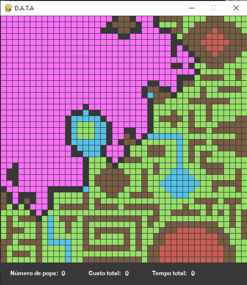

## SEARCH HEURISTICS - Introdução a IA

Nessa implementação, são propostas duas formas de encontrar um melhor caminho (com menor custo) baseada em uma matriz
pré determinada. São elas: 

- Blind Search Uniform Cost - BFS
- Manhattan Distance

Além disso, cada quadrado possui uma cor diferente, representando um custo diferente:

     Verde           (Custo: 1)
    Marrom          (Custo: 5)
    Azul            (Custo: 10)
    Vermelho        (Custo: 15)

### Base
Baseada na implementação padrão, onde é selecionado um nó que posteriormente é expandido e seus filhos passam a compor uma __Fronteira__ para que possa ser expandida, selecionando um nó e a exapandindo.

### Blind Search with Uniform Cost - BFS

Baseando-se no método de custo uniforme, a fronteira dita acima é sempre ordenada pelo menor custo, o que proporciona que quando o nó de origem apareça na fornteira, esse seja já o melhor caminho

#### Heurística de Ralo

Outra implementação para melhoria do algoritimo, é utilizado uma poda que denominamos poda de "Ralo". A mesma consiste em sinalizar ao algoritmo de ordenação da fronteira que o resultado alvo já está lá. Isso é feito, ajustando o custo desse ponto como o menor possível, nessa implementação esse custo vai para -9999. Sendo assim, quando o resultado alvo entra na fronteira, a ordenação já o coloca como o próximo a ser retirado da lista. 

    Usando em comparação a execução abaixo temos um ganho de aproximadamente 10 ms e menos 114 acessos a posições.

    - Para ativar acesse o arquivo: ./mapMatrixUI.py e descomente a linha 40

      Exemplo de Fronteira

      Exemplo de Resposta

 ### Manhattan Distance

    
Utiliza da implementação e lógica do BFS, entrentanto o cálculo de custo de um nó não é mais o correspondete na matriz, mas agora, seguindo o seguinte cálculo:

    dx = abs(posiçãoDoPróximoEmX - posiçãoFinalX)
    dy = abs(posiçãoDoPróximoEmY - posiçãoFinalY)

Onde **dx** é a diferença absoluta (exclui-se os sinais) entre a **posição final** no eixo X **menos** a **posição do próximo nó** no eixo X e **dy** é a diferença absoluta entre a **posição final** no eixo Y **menos** a **posição do próximo nó** no eixo Y e **dy** e **dy**.

Depois, soma-se os dois deltas e têm-se o Manhattan:

    dx + dy

Vale lembrar que a heurística de Manhattan é somada ao custo do próximo nó na fronteira, tornando-os uma **busca com informação A***.

Nota-se que usando a heurística de Distância Manhattan, há uma busca mais direcionada, onde as fronteiras de busca são mais concisas, resultando em um tempo menor de busca.

      Exemplo de Fronteira

      Exemplo de Resposta

__Pontos importantes para ambas as implementações:__

    - Em ambas as implementações, é realizada uma poda na Fronteira, onde não permitida a repetição de nós já visitados, sendo assim evitando *loops*

## Execução

- Para execução do projeto, basta executar o *app.py*.
- Alteração da matriz de entrada, altere o arquivo *index.txt*
    -   Em correspondencia ao arquivo setado como matriz de entrar, altere em ./properties/config.json as definições da Matriz inserida, como: Custo dos valores e dimensões da mesma; além de dimensões da tela e quadrados para melhor visualização.
- As duas primeiras linhas do arquivo da matriz, indicam *Origem* e *Destino* seguindo o padrão (X, Y)

    

Para o exemplo acima, temos a seguinte configuração: 

    0,0
    41,41
    2,1,1,1,1,2,1,3,1,1,1,1,1,1,1,1,2,2,2,2,2,2,2,1,1,1,2,2,2,2,2,1,1,1,1,2,2,2,1,1,1,1,
    [...]

Sendo o ponto marcado como preto a origem (0,0) e (41,41) o destino.
- No rodapé temos os resultados obtidos na busca.

- Como exemplo de *Fronteira/Borda* da busca temos a seguinte exeibição

    

- Rosa: Posições visitadas e já expandida
- Cinza: Posições na fronteira, que devem ser visitadas

